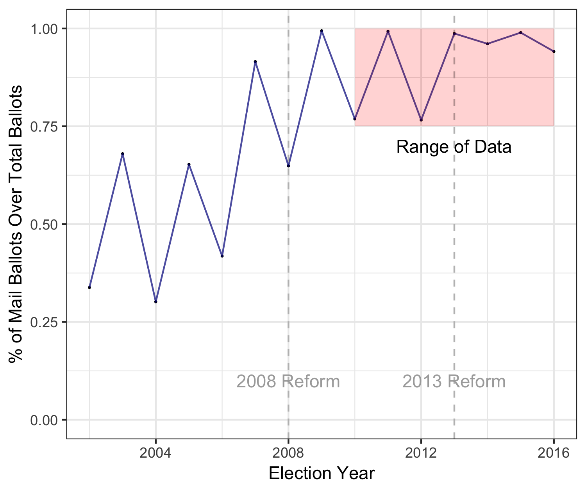

# Turnout and Mail Voting in Colorado or: How I learned to Stop Worrying and Love Voter Registration Files
### December 2018

This repository contains my senior thesis, completed across the Spring/Fall semesters of my last year at Reed College. This thesis is an ad-hoc interdisciplinary project, between the departments of Mathematics and Political Science. [Andrew Bray](http://andrewpbray.github.io/) and [Paul Gronke](https://blogs.reed.edu/paul-gronke/) advised this thesis.

Mail voting in the United States was conceived and first implemented to serve
absentee voters during the Civil War (Fortier, 2006) and has persisted until the present
day, becoming one of the key reforms associated with “convenience voting” and the
expansion of the democratic franchise (Gronke, Galanes-Rosenbaum, Miller, & Toffey,
2008). In 2013, Colorado implemented the latest in a series of in-state election reforms
and became the third state in the nation with universal mail voting for all elections,
after Oregon and Washington. 

Despite claims by policymakers that mail voting should
have a strong, positive effect on voter turnout, a recent series of studies on Oregon,
Washington, parts of California, and Colorado have failed to show consistent results,
disagreeing both on the scale and the direction (positive or negative) that this effect
has. This thesis aims at following this series of studies by examining Colorado voter
registration files for recent elections (2010-2016). These files consist of a registration
file with voter information and a history file with voter participation data in Colorado
elections, and provide all information necessary for a comprehensive study of turnout. I obtained the data for my thesis with the help of [Judd Choate](https://www.sos.state.co.us/), Director of Elections of the State of Colorado, and [Andrew Menger](www.andrewmenger.com), Postdoctoral Fellow at the Weidenbaum Center on the Economy, Government, and Public Policy at Washington University.

By describing, fitting, and interpreting multilevel general additive regression models of
voter turnout based on these data, I show that there is a small positive effect of mail
voting on turnout in national elections at the county level. This thesis also contributes
to the literature by presenting a description of modeling and data wrangling difficulties
associated with voter registration files, and giving a series of potential solutions, as
well as an extensive coding library to aid future research on the subject.

One such issue, that I was not able to solve in the course of this project, was the limited variability exhibited in the data; the data are extensive (over 35 million observations at the individual level)
but substantially lack variance in voting method. Put simply, the vast majority of
registrants in Colorado from 2010 onward either did not vote at all, or voted by mail.

### File Structure

I have attempted to make this analysis reproducible, though I am not able to
share the data I worked with. This is mainly due to file size and privacy concerns. While the data are public, and can be requested from the Secretary of State of Colorado, I have chosen not to publicly display the adresses, phone numbers, names, and turnout decisions of more than three quarters of Coloradoans.

The repository is organized as follows:

- **data_and_results**: contains .rmd files with some data wrangling and diagnostics, and the data used in this thesis. The data is not included in this GitHub page.
- **data_wrangling**: contains R scripts related to wrangling the voter history and voter registration files.
- **maps**: contains R scripts and pngs of all maps used in this thesis.
- **models**: model estimation. R scripts, .rmd files, and .pdf files that relate to running and evaluating models.
- **plots**: contains R scripts and pngs of all plots used in this thesis.
- **riggd**: the R package. This will continue to be updated even after the completion of the thesis.
- **tables**: R scripts used to output the tables in the final document.
- **thesis_outut_folder**: all of the writing for the thesis document. It is written entirely in R Markdown, created from an R markdown thesis template, which can be found at https://github.com/Reedies/reedtemplates. The template was created by Chester Ismay.

#### thesis_output_folder

Contains thsis template that actually builds full text

#### riggd

R package with full documentation, used in creating this thesis
#### README.md

